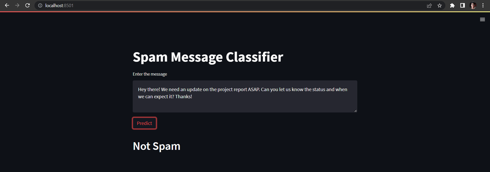
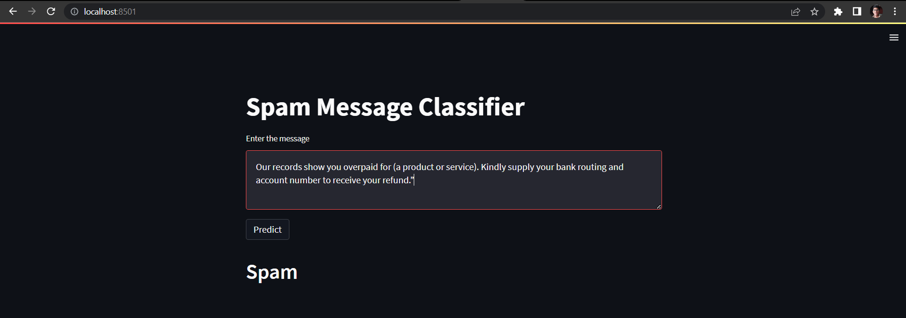

# Kaiburr-Assessment-Tast-5
#### The purpose of this repository is to provide a solution to Task 5 from the Kaiburr's Assessment. Submitted by Dev Bilaspure.

### Task Description
The task is to implement a sample machine learning program for a problem statement of our choice.

### Project Description
This project implements a machine learning model to classify text messages as spam or not spam. The model is trained on a dataset of SMS messages labeled as spam or not spam.

## Dataset
The dataset used to train the model is the `SMS Spam Collection dataset` from the UCI Machine Learning Repository. It contains 5,572 SMS messages that have been manually labeled as spam or not spam.

## Steps followed
1. Data cleaning
2. EDA
3. Text Preprocessing
4. Model Building
5. Evaluation
6. Improvements
7. Make web UI to demostrate the application

### Preprocessing Steps
- `Tokenization`: The text is split into individual words or tokens.
- `Lowercasing`: All words are converted to lowercase to ensure consistency.
- `Removing stopwords`: Common words such as "the", "a", and "an" are removed as they do not add significant meaning to the text.
- `Removing punctuation`: Punctuation marks such as commas and periods are removed to simplify the text.
- `Stemming`: Words are reduced to their root form using a Porter stemmer.  

The preprocessing is implemented using the NLTK library.

### Model Training  
The model was trained using a Naive Bayes classifier, which is a probabilistic machine learning algorithm that is commonly used for text classification tasks.  
The preprocessed text data is vectorized using a TF-IDF vectorizer. TF-IDF stands for term frequency-inverse document frequency and is a commonly used method for text vectorization in natural language processing. It assigns a weight to each word in the text based on its frequency and how common it is across all documents in the dataset.  
The model is trained using scikit-learn, a popular machine learning library.

### Model Evaluation
The performance of the model is evaluated using a test set that is separate from the training set. The accuracy, precision, recall, and F1-score are calculated to measure the performance of the model.

### Web UI
The trained model is deployed as a web application using the Streamlit library in Python. Streamlit is a popular library for building interactive web applications with machine learning models.  

The web application allows users to enter a text message and receive a prediction of whether it is spam or not spam.
#### Screenshots
For a non-spam message:  
  

For a spam message:  
  

### Files 
- `Spam Message Classifier.ipynb`: Jupyter notebook containing the code for preprocessing the data, training the model, and evaluating the model.
- `app.py`: Python script containing the code for the web application.
- `model.pkl`: Pickle file containing the trained model.
- `vectorizer.pkl`: Pickle file containing the TF-IDF vectorizer.

### Getting Started
To run the web application, follow these steps:  
1. Clone this repository.
2. Navigate `cd spam-sms-classifier-application/venv`
3. Run the web application: `streamlit run app.py`

